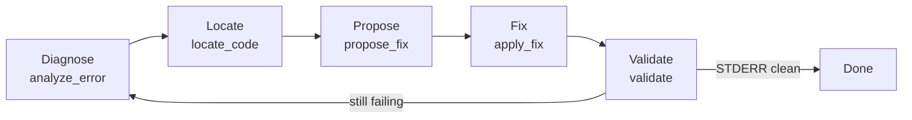

# AutofixAgent — Self-Healing Codebase Agent

<p align="center">
  <b>An autonomous AI agent that explores, diagnoses, and repairs Python codebases inside a secure sandbox.</b>
</p>

<p align="center">
  
  
  
  
  
</p>

AutofixAgent is an open-source side project that turns a **"Think → Act → Loop"**
repair cycle into a production-minded tool: given a buggy Python codebase, it
diagnoses the failure, locates the responsible code, proposes and applies a
minimal fix, then re-runs the program to verify the repair — all without ever
leaving the sandbox it is confined to.

It uses **Gemini** for reasoning, **LangGraph** to orchestrate a six-phase state
machine (Diagnose → Locate → Propose → Fix → Validate → Done), and a hardened
path-level sandbox so the agent can read and write *only* inside the project
it was pointed at.

---

## ✨ Features

### LangGraph six-phase state machine



- Explicit phase prompts keep the LLM focused on one job at a time.
- Validation failure **automatically rewinds to Diagnose** instead of guessing.
- A hard iteration cap stops runaway loops and force-finishes cleanly.

### Perception-first tool-use discipline

Designed to mitigate tool-call hallucination:

| Rule | Behavior |
| --- | --- |
| **Read before modify** | Every phase instructs the model to observe files with `read_header` before touching them. |
| **≤ 50-line rewrite** | Small files are overwritten whole with `write_file` — no fragile regex matching. |
| **Literal patches** | Large files use `patch_file`, which escapes all regex metacharacters and requires a 1:1 literal match including indentation. |
| **Auto re-read on mismatch** | If a patch reports "pattern not found", the model is told to stop, re-read the file, and switch strategies instead of retrying blindly. |

### Stability & observability

- **Path-level sandbox escape prevention**: every file-system tool resolves and
  validates paths through a shared security module that blocks absolute paths,
  `..` traversal, sibling-directory prefix spoofing, and symlink escapes.
- **Iteration cap**: `MAX_ITERATIONS` guards the whole workflow.
- **Execution timeout**: every subprocess is bounded by `EXEC_TIMEOUT` (default
  30s) so a hung script cannot stall the loop.
- **Thought / Action / Observation logging**: every model thought, tool call,
  and tool result is streamed to the console and appended to a timestamped
  trace file in `logs/`, giving a complete audit trail of the repair.

### Docker-first runtime

The project ships with a `Dockerfile` and `docker-compose.yml`, so the agent can
run against an arbitrary buggy codebase in a clean, reproducible container and
re-verify fixes by re-running the target script.

### CLI & repair artifacts

`python -m autofix` (or the `autofix` console script) turns the agent into a
tool: point it at any project, cap iterations, and it writes a **repair report**
— files changed with diffs, per-phase thought/action/observation trace, LLM
token usage and estimated cost — as Markdown or JSON under `reports/`.

### Measurable evaluation

[`benchmarks/benchmark.py`](benchmarks/benchmark.py) runs the agent over an
injected-bug corpus (import errors, syntax errors, logic errors, timeouts,
large-file patches, …), verifies each fix by re-running the target script, and
reports success rate, iterations, and duration.

### Provider-agnostic LLM layer

All model access goes through a `BaseLLM` interface (`llm/`) with a Gemini
implementation that adds exponential-backoff retries and per-run token/cost
statistics. Swapping providers is a factory-level change.

---

## 🚀 Quick Start

### 1. Prerequisites

- Python 3.11 or 3.12 (or Docker)
- A Google Gemini API key

### 2. Configuration

Copy `.env.example` to `.env` and fill in your key:

```env
GOOGLE_API_KEY=your_gemini_api_key_here
PROJECT_ROOT=./sandbox/example_project
EXEC_TIMEOUT=30
```

### 3. Install

```bash
pip install -r requirements.txt
```

### 4. Run

Place a buggy Python project anywhere (see
[`sandbox/buggy_project`](sandbox/buggy_project/README.md) for a ready-made
demo), then point the CLI at it:

```bash
python -m autofix --project sandbox/buggy_project --report reports/repair.md
```

The agent will explore the project, run its `main.py`, diagnose the failure,
apply a fix, and re-run until the program produces clean `STDOUT` (or the
iteration cap is reached). A repair report with diffs and the full trace is
written to the path given by `--report`.

### CLI reference

```text
usage: autofix [-h] [--project PROJECT] [--task TASK] [--max-iterations N]
               [--model MODEL] [--exec-timeout SECONDS]
               [--report PATH] [--report-format {md,json}] [--no-report]
               [--version]
```

| Flag | Default | Description |
| --- | --- | --- |
| `--project` | `config.PROJECT_ROOT` | Sandbox project to repair |
| `--task` | run & fix errors | Task given to the agent |
| `--max-iterations` | `10` | Hard cap on workflow iterations |
| `--model` | config | Override the LLM model name |
| `--exec-timeout` | config | Per-subprocess timeout in seconds |
| `--report` | `reports/repair_<ts>.md` | Report path; format follows extension |
| `--report-format` | inferred | Force `md` or `json` |
| `--no-report` | off | Skip writing the report artifact |

After `pip install -e .`, the same interface is available as the `autofix`
console command.

### Running with Docker

```bash
cp .env.example .env   # fill in GOOGLE_API_KEY
docker compose up --build
```

The compose file mounts `./sandbox` and `./logs` into the container and targets
the `buggy_project` demo by default.

---

## 📂 Project Structure

```text
.
├── autofix/
│   ├── cli.py              # command-line interface
│   ├── runner.py           # repair execution + snapshot diffing
│   └── report.py           # Markdown/JSON report artifacts
├── agent/
│   ├── workflow.py        # LangGraph state machine & phase routing
│   └── prompts.py         # Phase-specific system prompts
├── llm/
│   ├── base.py            # BaseLLM interface, retry helper, usage stats
│   ├── gemini.py          # Gemini provider with retries & cost tracking
│   └── factory.py         # provider factory (extension point)
├── tools/
│   ├── explorer_tools.py  # list_files, find_file, grep_text, read_header
│   ├── editor_tools.py    # write_file, patch_file, insert_line
│   └── executor_tools.py  # run_python_script (bounded by EXEC_TIMEOUT)
├── benchmarks/
│   ├── benchmark.py       # batch evaluation runner
│   └── corpus/            # injected-bug mini projects with meta.json
├── utils/
│   ├── sandbox.py         # path-level containment checks (security core)
│   └── logger.py          # thought/action/observation console + file logging
├── sandbox/
│   ├── example_project/   # default healthy target
│   └── buggy_project/     # demo target with an injected import defect
├── tests/                 # sandbox & config security tests
├── docs/
│   └── ARCHITECTURE.md    # deep-dive design document
├── config.py              # env-driven configuration
├── state.py               # LangGraph state schema (AgentState)
├── main.py                # legacy entry point (delegates to autofix CLI)
├── Dockerfile
├── docker-compose.yml
├── Makefile
└── LICENSE
```

## 📊 Benchmark

The corpus in `benchmarks/corpus/` contains one mini project per injected
defect, each with a `meta.json` describing the bug type and expected output.

| Bug type | Cases |
| --- | ---: |
| Import error | `import_mismatch`, `missing_module` |
| Syntax error | `syntax_error` |
| Runtime error | `zero_division`, `type_error_concat`, `attribute_error`, `undefined_name`, `wrong_return_type` |
| Logic error (exit 0, wrong output) | `logic_error_mean`, `off_by_one_logic` |
| Timeout guard | `infinite_loop` |
| Large-file literal patch | `large_file_patch` |

Run the benchmark (requires the API key):

```bash
python benchmarks/benchmark.py                 # full corpus
python benchmarks/benchmark.py --limit 3       # quick subset
python benchmarks/benchmark.py --smoke         # plumbing check, no API calls
```

Results are printed per case and written to `reports/benchmark_<timestamp>.{json,md}`.
After a real run, copy the Markdown table here to keep a public record:

| Case | Bug type | Agent status | Iterations | Duration (s) | Passed |
| --- | --- | --- | ---: | ---: | --- |
| _pending first run_ | | | | | |

## ⚙️ Configuration

| Variable | Default | Description |
| --- | --- | --- |
| `GOOGLE_API_KEY` | — | Gemini API key (required) |
| `LLM_PROVIDER` | `gemini` | Reasoning provider (factory extension point) |
| `MODEL_NAME` | `gemini-2.5-flash` | LLM used for reasoning |
| `TEMPERATURE` | `0` | Sampling temperature |
| `PROJECT_ROOT` | `./sandbox/example_project` | Sandbox root the agent may read/write |
| `EXEC_TIMEOUT` | `30` | Per-subprocess execution timeout (seconds) |
| `MAX_ITERATIONS` | `10` | Hard cap on workflow iterations |
| `LLM_MAX_RETRIES` | `3` | LLM retry attempts on transient failures |
| `LLM_RETRY_BASE_DELAY` | `1.0` | Backoff base delay (seconds) |
| `REPORTS_DIR` | `reports` | Directory for repair/benchmark artifacts |

## 🔒 Security Design

All file-system access funnels through `utils/sandbox.py`, which resolves the
configured root once with `realpath` and rejects any path whose canonical form
falls outside it. This defends against:

- absolute paths (`/etc/passwd`)
- parent traversal (`../../`)
- sibling prefix spoofing (`sandbox_evil` when the root is `sandbox`)
- symlinks pointing outside the sandbox

The sandbox boundary is enforced at the *tool* layer, so even if the model is
prompted (or tricks itself) into requesting an out-of-scope path, the request is
rejected with a `PermissionError`.

## 🧪 Development

```bash
pip install -r requirements-dev.txt
make test        # or: python -m pytest
```

The test suite covers sandbox containment (traversal, absolute paths, sibling
spoofing, symlink escapes) and configuration sanity.

## 📖 Documentation

See [docs/ARCHITECTURE.md](docs/ARCHITECTURE.md) for a deep dive into the state
machine, tool discipline, security model, and extension points.

## 📄 License

MIT — see [LICENSE](LICENSE).
